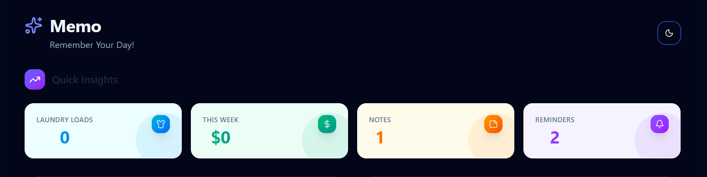
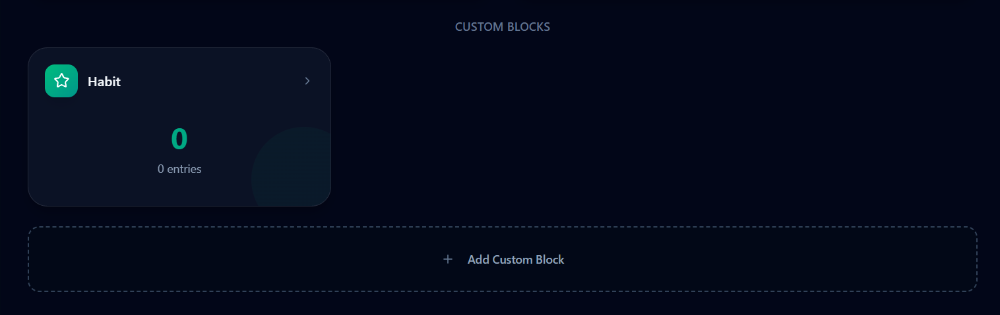
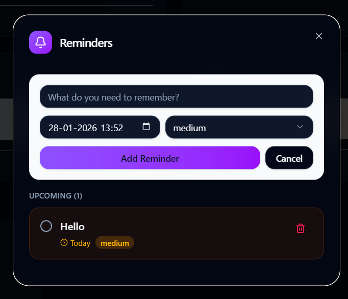
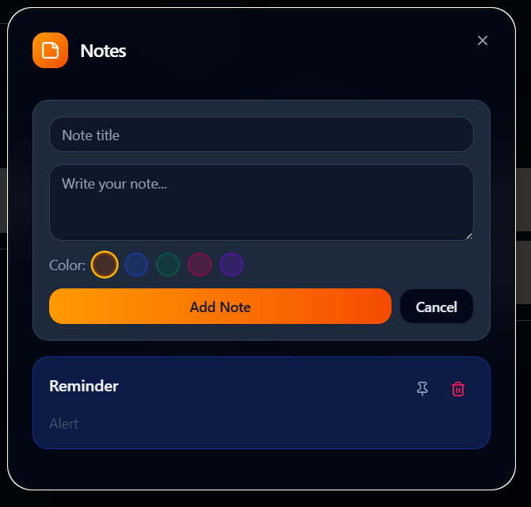

# Memo

A local-first personal life dashboard to manage laundry, spending, reminders, notes and custom trackers --- all in one place.

No backend. No cloud. Your data stays on your device.

------------------------------------------------------------------------

## Banner

]

------------------------------------------------------------------------

## Screenshots

  -----------------------------------------------------------------------------------------------------------------------------
  Dashboard                                   Laundry Manager                         Spending Tracker
  ------------------------------------------- --------------------------------------- -----------------------------------------
        

  -----------------------------------------------------------------------------------------------------------------------------

  ---------------------------------------------------------------------------------------------------------------------
  Reminders                                   Notes                               Custom Blocks
  ------------------------------------------- ----------------------------------- -------------------------------------
        

  ---------------------------------------------------------------------------------------------------------------------


------------------------------------------------------------------------

## Features

### Laundry Manager

Track laundry loads by type
Move loads through Pending → Washing → Drying → Complete
Get a daily alert if laundry is left pending

### Spending Tracker

Log expenses with categories
View totals for Today, This Week and This Month

### Reminders

Set reminders with priority levels
Get browser notifications when reminders are due

### Notes

Create color-coded sticky notes
Pin important notes to the top

### Custom Blocks

Create checklists, counters and text logs
Customize icons and colors

------------------------------------------------------------------------

## Interface

Light and dark mode
Glass-style UI cards
Responsive layout for mobile and desktop
Smooth animations

------------------------------------------------------------------------

## Tech Stack

  Layer        Tech
  ------------ ----------------
  Frontend     React + Vite
  Styling      Tailwind CSS
  Database     IndexedDB
  State Sync   TanStack Query
  Icons        Lucide React
  Animations   Framer Motion

------------------------------------------------------------------------

## Local Data Storage

All data is stored in IndexedDB in your browser.
No servers, no accounts, no tracking.
Works fully offline.

------------------------------------------------------------------------

## Run Locally

Clone the project:

``` bash
git clone https://github.com/your-username/memo.git
cd memo
```

Install dependencies:

``` bash
npm install
```

Start the dev server:

``` bash
npm run dev
```

Open: http://localhost:5173

------------------------------------------------------------------------

## Vite + React Template Note

This project was created using the official React + Vite template.

Fast Refresh is provided by: - @vitejs/plugin-react (Babel) -
@vitejs/plugin-react-swc (SWC)

------------------------------------------------------------------------

## Author

Krithika
